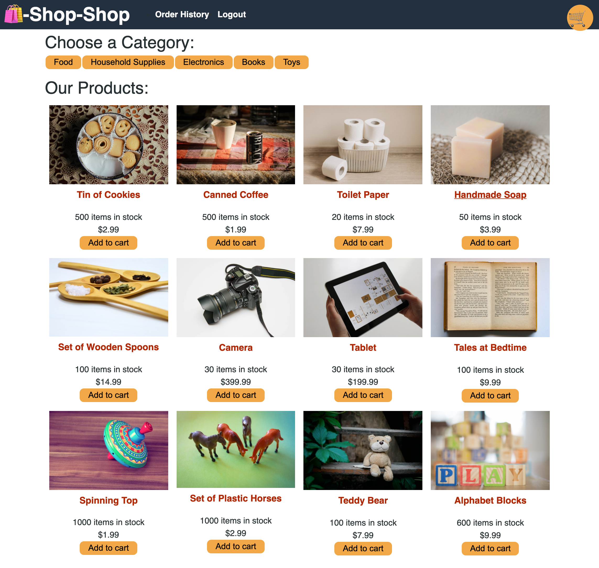

# Shop Shop Challenge

## Description
Refactoring an e-commerce platform from the UA Bootcamp Module #22 so that it uses Redux. 

## Table Of Contents
  * [Usage](#usage)
  * [Contribution](#contribution)
  * [Questions](#questions)

## Usage
The app works on localhost, but I cannot get it to deploy to heroku for some reason, so it is what it is at this point. The deployed application is supposed to be found at https://shielded-journey-73080.herokuapp.com/. Instead, to see the app in action, please download the files located in this repository; install dependencies as found in the package.json files; and run `npm install`, `npm run seed`, and `npm start`.
  

## Contribution
Clearly I need your help.

## Questions
Please contact me at [kristin@icloud.com](mailto:kristin@icloud.com) with any questions. You can also find me on GitHub, username [kristinmoon](https://github.com/kristinmoon).

